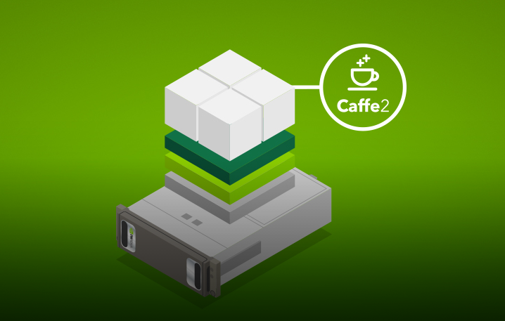
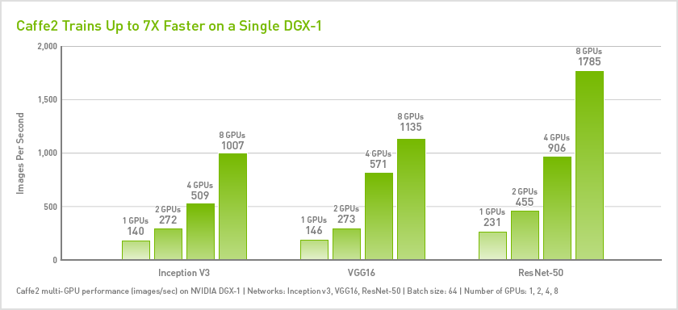

# **Python Application Development Using Caffe2** #
 <!--images-->

**Caffe2** is a deep learning framework that provides an easy and straightforward way for you to experiment with deep learning and leverage community contributions of new models and algorithms. You can bring your creations to scale using the power of GPUs in the cloud or to the masses on mobile with Caffe2’s cross-platform libraries. Built on the original Caffe, Caffe2 is designed with expression, speed, and modularity in mind, allowing for a more flexible way to organize computation.

Facebook elaborates more in a blog post, saying that Caffe2 is a “lightweight and modular deep learning framework emphasizing portability while maintaining scalability and performance.” The company worked closely with Amazon Web Services, Intel Corp., Microsoft Corp., Qualcomm Inc. and Nvidia Corp. to optimize Caffe2 for the cloud and mobile devices, it said.

Caffe2 can be used to program AI features into mobile devices, which will enable them to recognize images, speech, text and videos, and become more “situationally aware,” Facebook said. It’s significant because such capabilities have until now always been offloaded to remote servers in the cloud, meaning smartphones and other devices have to be connected to the web to offer this kind of functionality. Caffe2 is different, however, as it works within the low-power constraints of such devices, which means a connection to the cloud is no longer necessary to deliver AI capabilities. Caffe2 can do this because it leverages the advanced computing power of next-generation mobile chips to accelerate deep learning tasks. In smartphones, for example, Caffe2 harnesses the power of Adreno graphics processing units and Hexagon digital signal processors on Qualcomm Inc.’s Snapdragon chips.
“We’re committed to providing the community with high-performance machine learning tools so that everyone can create intelligent apps and services,” Facebook said in a blog post on the Caffe2 website.

#### Some of the most commonly asked questions about Caffe2 are: ###
**What does Caffe2 do well? How is it different from Caffe or other deep learning frameworks?** 
Modularity and being designed for both scale and mobile deployments are the high-level answers to the first question. In many ways Caffe2 is an un-framework because it is so flexible and modular.
Also Caffe2 improves Caffe 1.0 in a series of directions:
-	first-class support for large-scale distributed training
-	mobile deployment
-	new hardware support (in addition to CPU and CUDA)
-	flexibility for future directions such as quantized computation
-	stress tested by the vast scale of Facebook applications

### Caffe2 performance
Caffe2 features built-in distributed training using the NCCL multi-GPU communications library. This means that you can very quickly scale up or down without refactoring your design. Caffe2 delivers near-linear scaling of deep learning training achieving up to 7.7x speed up with 8 GPUs, compared to a single GPU training.

  <!--images-->

### Installation (Caffe2 on desktop and datacenter) ###
To make it easy to install Caffe2 from source, locally on your desktop or datacenter, follow the step-by-step instruction in the Caffe2 GPU-Ready App Quick Start Guide. GPU-Ready Apps guides provides installation recipes that helps you get up and running fast on GPUs.
Visit Caffe2 installation page to learn more about for other ways to get Caffe2, including pre-compiled binaries, docker images.
