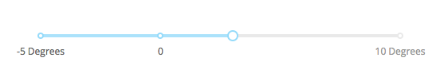

# **Python Application Development Using Dash** #
Dash is an Open Source Python library for creating reactive, Web-based applications. Dash is a user interface library for creating analytical web applications. Those who use Python for data analysis, data exploration, visualization, modelling, instrument control, and reporting will find immediate use for Dash.
Dash makes it dead-simple to build a GUI around your data analysis code. 

Here’s a 43-line example of a Dash App that ties a Dropdown to a D3.js Plotly Graph. As the user selects a value in the Dropdown, the application code dynamically exports data from Google Finance into a Pandas DataFrame.

 <!--images-->


Dash provides a simple interface for tying UI controls, like sliders, dropdowns, and graphs, with your Python data analysis code.  Applications built with Dash can be used to explore data, tweak your models, monitor your experiments, or roll your own business intelligence platform. Dash is the frontend to your analytical Python backend. Dash apps are powered by Plotly.js, a fully featured charting library including maps like these, financial charts, scientific graphs, and more. 

Dash app code is declarative and reactive, which makes it easy to build complex apps that contain many interactive elements.  Every aesthetic element of the app is customizable: The sizing, the positioning, the colors, the fonts. Dash apps are built and published in the Web, so the full power of CSS is available. While Dash apps are viewed in the web browser, you don’t have to write any Javascript or HTML. Dash provides a Python interface to a rich set of interactive web-based components. 
**For example:**
```python
import dash_core_components as dcc
dcc.Slider(value=4, min=-10, max=20, step=0.5,
           labels={-5: '-5 Degrees', 0: '0', 10: '10 Degrees'})
```
**Output:**
  <!--images-->

When an input element changes (e.g. when you select an item in the dropdown or drag a slider), Dash’s decorator provides your Python code with the new value of the input. Your Python function can do anything that it wants with this input new value: It could filter a Pandas DataFrame, make a SQL query, run a simulation, perform a calculation, or start an experiment. Dash expects that your function will return a new property of some element in the UI, whether that’s a new graph, a new table, or a new text element.
Dash leverages the power of Flask and React, putting them to work for Python data scientists who may not be expert Web programmers.
### Concurrency — Multi-User Applications ###
The state of a Dash application is stored in the front-end (i.e. the web browser). This allows Dash apps to be used in a multitenant setting: Multiple users can have independent sessions while interacting with a Dash app at the same time. Dash application code is functional: Your application code can read values from the global Python state but it can’t modify them. This functional approach is easy to reason about and easy to test: It’s just inputs and outputs with no side-effects or state.
### Installation ###
To use Dash, we need the following packages: dash, dash-renderer, dash-html-components, dash-core-components, and plotly. These packages also have various dependencies. You can install them with:
```{r, engine='bash', count_lines}
sudo pip install dash dash-renderer dash-html-components dash-core-components plotly
```
or, on Windows, open cmd.exe as administrator and do
```{r, engine='shell', count_lines}
pip install dash dash-renderer dash-html-components dash-core-components plotly.
```

