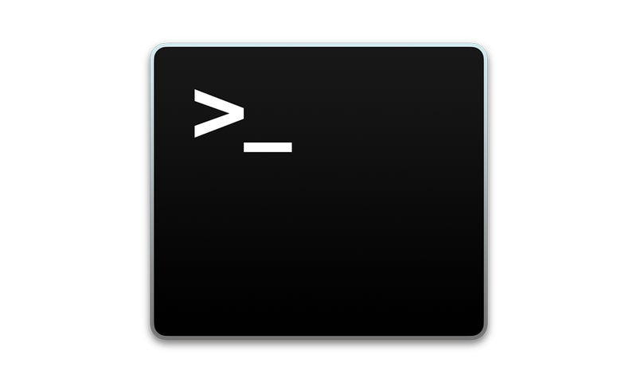

# **Python Application Development Using Fire** #
<!--images-->


Python Fire is a library for automatically generating command line interfaces (CLIs) from absolutely any Python object. It’s called Fire because when you call Fire(), it fires off your command.
-	Python Fire is a simple way to create a CLI in Python. 
-	Python Fire is a helpful tool for developing and debugging Python code.  
-	Python Fire helps with exploring existing code or turning other people's code into a CLI.  
-	Python Fire makes transitioning between Bash and Python easier. 
-	Python Fire makes using a Python REPL easier by setting up the REPL with the modules and variables you'll need already imported and created. 

Python Fire generates command line interfaces (CLIs) from any Python code. Simply call the Fire function in any Python program to automatically turn that program into a CLI. 

The library is available from pypi via 
```{r, engine='shell', count_lines}
pip install fire
```
With Fire you don't have to define arguments, set up help information, or write a main function that defines how your code is run. Instead, you simply call the `Fire` function from your main module, and Python Fire takes care of the rest. It uses inspection to turn whatever Python object you give it (whether it's a class, an object, a dictionary, a function, or even a whole module) into a command line interface, complete with tab completion and documentation, and the CLI will stay up-to-date even as the code changes.

You can call Fire on any Python object: functions, classes, modules, objects, dictionaries, lists, tuples, etc. They all work!
**Examples:**
A simple Hello World program
```python
import fire
english = 'Hello World'
spanish = 'Hola Mundo'
fire.Fire()
```
**You can use it like this:**
```{r, engine='shell', count_lines}
$ python example.py english
Hello World
$ python example.py spanish
Hola Mundo
```
Fire also works on classes. This is another good way to expose multiple commands.
```python
import fire
class BrokenCalculator(object):

  def __init__(self, offset=1):
      self._offset = offset

  def add(self, x, y):
    return x + y + self._offset

  def multiply(self, x, y):
    return x * y + self._offset

if __name__ == '__main__':
  fire.Fire(BrokenCalculator)
```
When you use a broken calculator, you get wrong answers:
```{r, engine='shell', count_lines}
$ python example.py add 10 20
31
$ python example.py multiply 10 20
201
```

But you can always fix it:
```
$ python example.py add 10 20 --offset=0
30
$ python example.py multiply 10 20 --offset=0
200
```

Of course, you can continue to use this module like an ordinary Python library, enabling you to use the exact same code both from Bash and Python. If you're writing a Python library, then you no longer need to update your main method or client when experimenting with it; instead you can simply run the piece of your library that you're experimenting with from the command line. Even as the library changes, the command line tool stays up to date.

"At Google, engineers use Python Fire to generate command line tools from Python libraries. We have an image manipulation tool built by using Fire with the Python Imaging Library, PIL. In Google Brain, we use an experiment management tool built with Fire, allowing us to manage experiments equally well from Python or from Bash", says David Bieber, Software Engineer on Google Brain.
