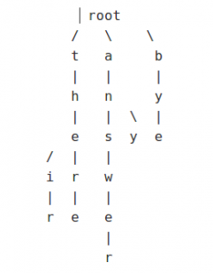

# **Python Application Development Using Flashtext** #
 <!--images-->


FlashText is a Python library created specifically for the purpose of searching and replacing words in a document. Now, the way FlashText works is that it requires a word or a list of words and a string. The words which FlashText calls keywords are then searched or replaced in the string.
When keywords are passed to FlashText for searching or replacing, they are stored as a Trie Data Structure which is very efficient at Retrieval tasks. Below is an example of how a Trie Data Structure looks like.
  <!--images-->

Above is a Trie Data Structure for the words (their, there, answer, any, and bye).
Now, in case of searching the keywords, FlashText will return the keywords that are present in the string. In case of replacing, FlashText will create a new string with the keywords replaced. Both these operations happen over a single pass. Now it is important to understand the concept of the single pass.
An example of single pass replacement looks like this:

>String = “spamham sha”
Replace “spam” with “eggs” and “sha” with “md5”

Now let’s see how does the String look like with and without a single pass.
>Single-pass
String = “eggsham md5”

>Without Single-pass
String = “eggmd5m md5”

Above, you can see the difference between the single pass and without the single pass.

### How is FlashText so fast? ###
It is imperative that we understand – What is that FlashText has which Regular Expressions don’t? After all, Regular Expressions are mostly considered the one-stop solution for string manipulation in terms of both speed and variety of manipulations that can be done. This can be better understood with the help of an example by the author of the FlashText package himself.

Suppose, there is a string called sample = ” This is a sample sentence” and a collection of words called keywords = {sample, sameer, pony, time}. Now, if we are to perform searching of the keywords in the sample,  there are 2 ways of doing it.
**Method 1:**
for each word in keywords:   _**Line 1**_
check if word exists in sample: _**Line 2**_
Now the above method has a loop which will run n times, where n is the number of words in the keywords.  Also, there will be significant time consumption in Line 2 which checks whether a particular word is present in a string or not.
**Method 2:**
for each word in sample: _**Line 1**_
check if word exists in the keywords dictionary  _**Line 2**_
Now, the loop in this method will run m times, where m is the number of words in the sample. The major advantage is the execution time of Line 2. Checking a key in a dictionary is a significantly faster process than checking for a word in a string.

FlashText uses Method 2 for faster searching and replacing and is inspired by the Aho-Corasick Algorithm and Trie Data Structure.

### Installing FlashText ###
Installing FlashText is as easy as any other package. In command prompt/ terminal, type:
```{r, engine='shell', count_lines}
pip install flashtext
```

**Examples:**
Extract keywords
```python

>>> from flashtext import KeywordProcessor
>>> keyword_processor = KeywordProcessor()
>>> # keyword_processor.add_keyword(<unclean name>, <standardised name>)
>>> keyword_processor.add_keyword('Big Apple', 'New York')
>>> keyword_processor.add_keyword('Bay Area')
>>> keywords_found = keyword_processor.extract_keywords('I love Big Apple and Bay Area.')
>>> keywords_found
>>> # ['New York', 'Bay Area']
Replace keywords
>>> keyword_processor.add_keyword('New Delhi', 'NCR region')
>>> new_sentence = keyword_processor.replace_keywords('I love Big Apple and new delhi.')
>>> new_sentence
>>> # 'I love New York and NCR region.'
```

### Conclusion: ###
FlashText is any day better than regular expressions for replacing keywords in a document.


