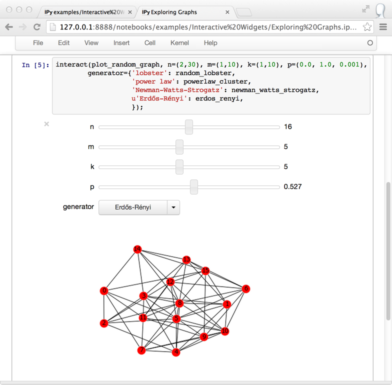

# **Python Application Development Using IPython** #
 <!--images-->

**IPython** (Interactive Python) is a command shell for interactive computing in multiple programming languages, originally developed for the Python programming language, that offers introspection, rich media, shell syntax, tab completion, and history. IPython provides the following features:
- Interactive shells (terminal and Qt-based).
- A browser-based notebook interface with support for code, text, mathematical expressions, inline plots and other media.
- Support for interactive data visualization and use of GUI toolkits.
- Flexible, embeddable interpreters to load into one's own projects.
- Tools for parallel computing.

IPython is based on an architecture that provides parallel and distributed computing. IPython enables parallel applications to be developed, executed, debugged and monitored interactively. Hence, the I (Interactive) in IPython. This architecture abstracts out parallelism, which enables IPython to support many different styles of parallelism including:
 - Single program, multiple data (SPMD) parallelism
 - Multiple program, multiple data (MIMD) parallelism
 - Message passing using MPI
 - Task parallelism
 - Data parallelism
 - Combinations of these approaches
 - Custom user defined approaches
 
IPython allows non-blocking interaction with Tkinter, PyGTK, PyQt/PySide and wxPython (the standard Python shell only allows interaction with Tkinter). IPython can interactively manage parallel computing clusters using asynchronous status callbacks and/or MPI. IPython can also be used as a system shell replacement. Its default behavior is largely similar to Unix shells, but it allows customization and the flexibility of executing code in a live Python environment. 

IPython provides a rich toolkit to help you make the most of using Python interactively. Its main components are:
-	A powerful interactive Python shell
 
-	A Jupyter kernel to work with Python code in Jupyter notebooks and other interactive frontends.

The enhanced interactive Python shells and kernel have the following main features:
-	Comprehensive object introspection.
-	Input history, persistent across sessions.
-	Caching of output results during a session with automatically generated references.
-	Extensible tab completion, with support by default for completion of python variables and keywords, filenames and function keywords.
-	Extensible system of ‘magic’ commands for controlling the environment and performing many tasks related to IPython or the operating system.
-	A rich configuration system with easy switching between different setups (simpler than changing $PYTHONSTARTUP environment variables every time).
-	Session logging and reloading.
-	Extensible syntax processing for special purpose situations.
-	Access to the system shell with user-extensible alias system.
-	Easily embeddable in other Python programs and GUIs.
-	Integrated access to the pdb debugger and the Python profiler.
-	The Command line interface inherits the above functionality and adds real multi-line editing thanks to prompt_toolkit.
-	Syntax highlighting as you type
-	Integration with command line editor for a better workflow.

The kernel also has its share of features. When used with a compatible frontend, it allows:
-	the object to create a rich display of Html, Images, Latex, Sound and Video.
-	interactive widgets with the use of the ipywidgets package.

### Installation ###
Follow the guide below to install IPython, and to install kernels for Jupyter if you wish to work with multiple version of Python, or multiple environments.
**Install IPython:**
```{r, engine='shell', count_lines}
$ pip install ipython
```
**Install and register an IPython kernel with Jupyter:**
```{r, engine='shell', count_lines}
$ python -m pip install ipykernel
$ python -m ipykernel install [--user] [--name <machine-readable-name>] [--display-name <"User Friendly Name">]
```
  <!--images-->


