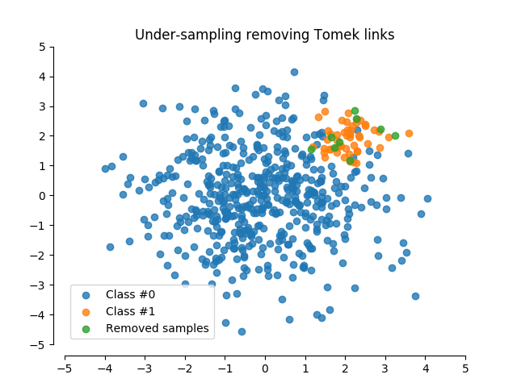

# **Python Application Development Using Imbalanced-learn** #
<!--images-->


**Imbalanced-learn** is a python package offering a number of re-sampling techniques commonly used in datasets showing strong between-class imbalance. It is compatible with scikit-learn and is part of scikit-learn-contrib projects.
Some of its Applications are in:
-	Bioinformatics
-	Medical imaging: diseases versus healthy
-	Social sciences: prediction of academic dropout
-	Web services: Service Level Agreement violation prediction
-	Security services: fraud detection

Most classification algorithms will only perform optimally when the number of samples of each class is roughly the same. Highly skewed datasets, where the minority is heavily outnumbered by one or more classes, have proven to be a challenge while at the same time becoming more and more common.
One way of addressing this issue is by re-sampling the dataset as to offset this imbalance with the hope of arriving at a more robust and fair decision boundary than you would otherwise.

**Re-sampling techniques are divided in two categories:**
    1.	Under-sampling the majority class(es).
    2.	Over-sampling the minority class.
    3.	Combining over- and under-sampling.
    4.	Create ensemble balanced sets.

imbalanced-learn is an open-source python toolbox aiming at providing a wide range of methods to cope with the problem of imbalanced dataset frequently encountered in machine learning and pattern recognition. The implemented state-of-the-art methods can be categorized into 4 groups: 
    **(i)**	under-sampling, 
    **(ii)**	over-sampling, 
    **(iii)**	combination of over- and under-sampling, and 
    **(iv)**	ensemble learning methods. 

-	**Under-sampling**
    1.	Random majority under-sampling with replacement
    2.	Extraction of majority-minority Tomek links
    3.	Under-sampling with Cluster Centroids
    4.	NearMiss-(1 & 2 & 3)  
    5.	Condensend Nearest Neighbour 
    6.	One-Sided Selection 
    7.	Neighboorhood Cleaning Rule 
    8.	Edited Nearest Neighbours 
    9.	Instance Hardness Threshold
    10.	Repeated Edited Nearest Neighbours 
    11.	AllKNN 
-	**Over-sampling**
    12.	Random minority over-sampling with replacement
    13.	SMOTE - Synthetic Minority Over-sampling Technique 
    14.	bSMOTE(1 & 2) - Borderline SMOTE of types 1 and 2 
    15.	SVM SMOTE - Support Vectors SMOTE 
    16.	ADASYN - Adaptive synthetic sampling approach for imbalanced learning
-	**Over-sampling followed by under-sampling**
    17.	SMOTE + Tomek links 
    18.	SMOTE + ENN
-	**Ensemble sampling**
    19.	EasyEnsemble 
    20.	BalanceCascade 
The different algorithms are presented in the sphinx-gallery.


The toolbox only depends on numpy , scipy, and scikit-learn and is distributed under MIT license. Furthermore, it is fully compatible with scikit-learn and is part of the scikit-learn-contrib supported project.
### Installation ###
imbalanced-learn is tested to work under Python 2.7, Python 3.5 and 3.6. The dependency requirements are based on the last scikit-learn release:
-	scipy (>=0.13.3)
-	numpy (>=1.8.2)
-	scikit-learn (>=0.19.0)

imbalanced-learn is currently available on the PyPi’s repository and you can install it via pip:
```{r, engine='shell', count_lines}
pip install -U imbalanced-learn
```
**Example**
The example here illustrates a sampling technique.
```{r, engine='shell', count_lines}
>>> from collections import Counter
>>> from sklearn.datasets import make_classification
>>> X, y = make_classification(n_samples=5000, n_features=2, n_informative=2,
...                            n_redundant=0, n_repeated=0, n_classes=3,
...                            n_clusters_per_class=1,
...                            weights=[0.01, 0.05, 0.94],
...                            class_sep=0.8, random_state=0)
>>> print(sorted(Counter(y).items()))
[(0, 64), (1, 262), (2, 4674)]
>>> from imblearn.under_sampling import ClusterCentroids
>>> cc = ClusterCentroids(random_state=0)
>>> X_resampled, y_resampled = cc.fit_sample(X, y)
>>> print(sorted(Counter(y_resampled).items()))
[(0, 64), (1, 64), (2, 64)]
```


