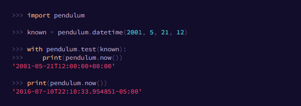

# **Python Application Development Using Pendulum** #
<!--images-->

## **Introduction** ##
Pendulum is a Python package to ease datetimes manipulation. It provides classes that are drop-in replacements for the native ones (they inherit from them).
Special care has been taken to ensure timezones are handled correctly, and are based on the underlying tzinfo implementation. For example all comparisons are done in UTC or in the timezone of the datetime being used.
Native datetime instances are enough for basic cases but when you face more complex use-cases they often show limitations and are not so intuitive to work with. Pendulum provides a cleaner and more easy to use API while still relying on the standard library. So it's still datetime but better.
Unlike other datetime libraries for Python, Pendulum is a drop-in replacement for the standard datetime class (it inherits from it), so, basically, you can replace all your datetime instances by DateTime instances in your code (exceptions exist for libraries that check the type of the objects by using the type function like sqlite3 or PyMySQL for instance). It also removes the notion of naive datetimes: each Pendulum instance is timezone-aware and by default in UTC for ease of use.
Pendulum also improves the standard timedate class by providing more intuitive methods and properties.
## **Installation** ##
Installing pendulum is quite simple:
```{r, engine='shell', count_lines} 
$ pip install pendulum
```
or, if you are using poetry:
```{r, engine='shell', count_lines} 
$ poetry add pendulum
```

## **Examples** ##
There are several different methods available to create a new DateTime instance.
First there is the main datetime() helper.
```
>>> import pendulum
>>> dt = pendulum.datetime(2015, 2, 5)
>>> isinstance(dt, datetime)
True
>>> dt.timezone.name
'UTC'
```
datetime() sets the time to 00:00:00 if it's not specified, and the timezone (the tz keyword argument) to UTC. It otherwise can be a Timezone instance or simply a string timezone value.
```
>>> import pendulum
>>> pendulum.datetime(2015, 2, 5, tz='Europe/Paris')
>>> tz = pendulum.timezone('Europe/Paris')
>>> pendulum.datetime(2015, 2, 5, tz=tz)
```
The local() helper is similar to datetime() but automatically sets the timezone to the local timezone.
```
>>> import pendulum
>>> dt = pendulum.local(2015, 2, 5)
>>> print(dt.timezone.name)
'America/Toronto'
```
Pendulum enforces timezone aware datetimes, and using them is the preferred and recommended way of using the library, however if you really need a naive DateTime object, the naive() helper is there for you.
```
>>> import pendulum
>>> naive = pendulum.naive(2015, 2, 5)
>>> naive.timezone
None
```
Pendulum provides helpers that returns a new instance with some attributes modified compared to the original instance. However, none of these helpers, with the exception of explicitely setting the timezone, will change the timezone of the instance. Specifically, setting the timestamp will not set the corresponding timezone to UTC.
Below is a comprehensive example you can make use of.
```python
>>> import pendulum

>>> now_in_paris = pendulum.now('Europe/Paris')
>>> now_in_paris
'2016-07-04T00:49:58.502116+02:00'

# Seamless timezone switching
>>> now_in_paris.in_timezone('UTC')
'2016-07-03T22:49:58.502116+00:00'

>>> tomorrow = pendulum.now().add(days=1)
>>> last_week = pendulum.now().subtract(weeks=1)

>>> past = pendulum.now().subtract(minutes=2)
>>> past.diff_for_humans()
>>> '2 minutes ago'

>>> delta = past - last_week
>>> delta.hours
23
>>> delta.in_words(locale='en')
'6 days 23 hours 58 minutes'

# Proper handling of datetime normalization
>>> pendulum.datetime(2013, 3, 31, 2, 30, tz='Europe/Paris')
'2013-03-31T03:30:00+02:00' # 2:30 does not exist (Skipped time)

# Proper handling of dst transitions
>>> just_before = pendulum.datetime(2013, 3, 31, 1, 59, 59, 999999, tz='Europe/Paris')
'2013-03-31T01:59:59.999999+01:00'
>>> just_before.add(microseconds=1)
'2013-03-31T03:00:00+02:00'
```

  <!--images-->


