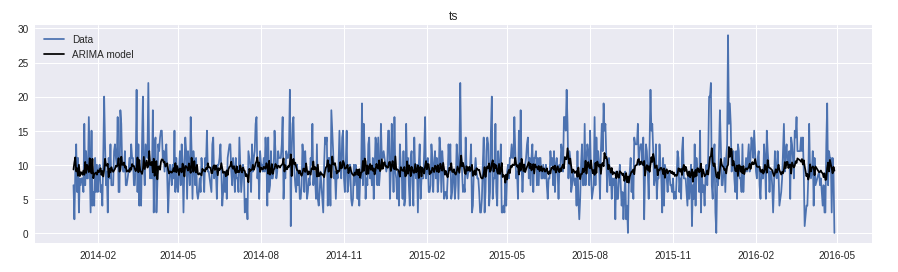

# **Python Application Development Using PyFlux** #
 <!--images-->



PyFlux is a library for time series analysis and prediction. Users can choose from a flexible range of modelling and inference options, and use the output for forecasting and retrospection. Users can build a full probabilistic model where the data 𝑦 and latent variables (parameters) 𝑧 are treated as random variables through a joint probability 𝑝 (𝑦, 𝑧). The advantage of a probabilistic approach is that it gives a more complete picture of uncertainty, which is important for time series tasks such as forecasting. Alternatively, for speed, users can simply use Maximum Likelihood estimation for speed within the same unified API.

The latest release version of PyFlux is available on PyPi. Python 2.7 and Python 3.5 are supported, but development occurs primarily on 3.5. To install pyflux, simply call pip: 
```{r, engine='shell', count_lines}
pip install pyflux 
```
PyFlux requires a number of dependencies, in particular numpy, pandas, scipy, patsy, matplotlib, numdifftools and seaborn.

### **Steps to conduct a model building process in PyFlux** ###
1.	**Create a model instance**
This is the first step, where the main arguments are 
(i) a data input, such as a pandas dataframe, 
(ii) design parameters, such as autoregressive lags for an ARIMA model, and 
(iii) a family, which specifies the distribution of the modelled time series, such as a Normal distribution. 
```python
my_model = pf.ARIMA(data=my_dataframe, ar=2, ma=0, family=pf.Normal())
```
2. **Prior Formation**
 This involves specifying a family for each latent variable in the model using the adjust_prior method, for example we can a prior for the constant in the ARIMA model 𝑁 (0, 10). The latent variables can be viewed by printing the latent_variables object attached to the model. Prior formation be ignored if the user is intending to just do Maximum Likelihood. 
 ```python
 print(my_model.latent_variables)
 ```

3.	**Model Fitting (or Inference)**
This involves using a fit method, specifying an inference option. Current options include Maximum Likelihood (MLE), Metropolis-Hastings (M-H), and black box variational inference (BBVI). Once complete, the model latent variable information will be updated, and the user can proceed to the post fitting methods. 
```python
x = my_model.fit('M-H') 
x.summary()
```
4.	**Model Evaluation, Retrospection and Prediction.** 
Once the model has been fit, the user can look at historical fit, criticize with posterior predictive checks, predict out of sample, and perform a range of other tasks for their model. Below are some example tasks
```python
my_model.plot_fit() # plots the fit of the model 
my_model.plot_sample(nsims=10) # draws samples from the model 
my_model.plot_ppc(T=np.mean) # plots histogram of posterior predictive check for mean 
my_model.plot_predict(h=5) # plots predictions for next 5 time steps 
my_model.plot_predict_is(h=5) # plots rolling in-sample prediction for past 5 time steps 
predictions = my_model.predict(h=5, intervals=True) # outputs dataframe of predictions 
samples = my_model.sample(nsims=10) # returns 10 samples from the data 
ppc_pvalue = my_model.ppc(T=np.mean) # p-value for mean posterior predictive test
```
PyFlux supports Bayesian inference for all the model types; it also supports classical methods of inference which can be considered as point mass approximations to the full posterior. PyFlux uses a unified family API that can be used for specifying model measurement densities as well as the priors on latent variables in the model.