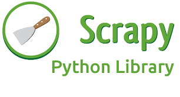
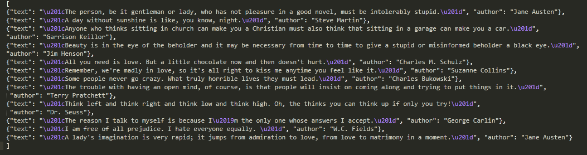

# **Python Application Development Using Scrapy** #
 <!--images-->

Web scraping, often called web crawling or web spidering, or “programatically going over a collection of web pages and extracting data,” is a powerful tool for working with data on the web.

With a web scraper, you can mine data about a set of products, get a large corpus of text or quantitative data to play around with, get data from a site without an official API, or just satisfy your own personal curiosity.

Scrapy is written in Python. It is one of the most popular and powerful Python scraping libraries; it handles a lot of the common functionality that all scrapers need so developers don't have to reinvent the wheel each time. It makes scraping a quick and fun process!

### **Creating a Basic Scraper** ###
Scraping is a two-step process:
1.	You systematically find and download web pages.
2.	You take those web pages and extract information from them.
If you have a recent Python version installled, you already have pip installed on your machine, so you can install Scrapy with the following command:
```{r, engine='shell', count_lines}
    pip install scrapy
```
With Scrapy installed, let's create an example of a Scrapy spider using the simplest way to run a spider.

Here’s the code for a spider that scrapes famous quotes from website http://quotes.toscrape.com, following the pagination:

```python
import scrapy

class QuotesSpider(scrapy.Spider):
    name = "quotes"
    start_urls = [
        'http://quotes.toscrape.com/tag/humor/',
    ]

    def parse(self, response):
        for quote in response.css('div.quote'):
            yield {
                'text': quote.css('span.text::text').extract_first(),
                'author': quote.xpath('span/small/text()').extract_first(),
            }

        next_page = response.css('li.next a::attr("href")').extract_first()
        if next_page is not None:
            yield response.follow(next_page, self.parse)
```
 Put this in a text file, name it to something like quotes_spider.py and run the spider using the runspider command:
```{r, engine='shell', count_lines}
    scrapy runspider quotes_spider.py -o quotes.json
```
When this finishes you will have in the quotes.json file a list of the quotes in JSON format, containing text and author, looking like this:
 <!--images-->

### **What just happened?** ###

When you ran the command scrapy runspider quotes_spider.py, Scrapy looked for a Spider definition inside it and ran it through its crawler engine.

The crawl started by making requests to the URLs defined in the start_urls attribute (in this case, only the URL for quotes in humor category) and called the default callback method parse, passing the response object as an argument. In the parse callback, we loop through the quote elements using a CSS Selector, yield a Python dict with the extracted quote text and author, look for a link to the next page and schedule another request using the same parse method as callback.

Here you notice one of the main advantages about Scrapy: requests are scheduled and processed asynchronously. This means that Scrapy doesn’t need to wait for a request to be finished and processed, it can send another request or do other things in the meantime. This also means that other requests can keep going even if some request fails or an error happens while handling it.

This Scrapy code below is to extract company details from Yelp into a csv file:
```python
import scrapy

class YlpSpider(scrapy.Spider):
    name = "yelp"
    allowed_domains = ["www.yelp.com"]
    start_urls = ['https://www.yelp.com/search?find_desc=Java+Developer&find_loc=Denver,+CO']


    def parse(self, response):
        companies = response.xpath('//*[@class="biz-listing-large"]')

        for company in companies:
            name = company.xpath('.//span[@class="indexed-biz-name"]/a/span/text()').extract_first()
            address1 = company.xpath('.//address/text()').extract_first('').strip()
            address2 = company.xpath('.//address/text()[2]').extract_first('').strip()  # '' means the default attribute if not found to avoid adding None.
            address = address1 + " - " + address2
            phone = company.xpath('.//*[@class="biz-phone"]/text()').extract_first().strip()
            website = "https://www.yelp.com" + company.xpath('.//@href').extract_first()

            yield{'Name':name, 'Address':address, 'Phone':phone, 'Website':website}
```
```{r, engine='shell', count_lines}
    scrapy runspider scriptfilename.py -o outputfile.csv
```
### **Conclusion** ###
That should be enough to get you experimenting. If you need more information on Scrapy, check out Scrapy’s official docs. 

