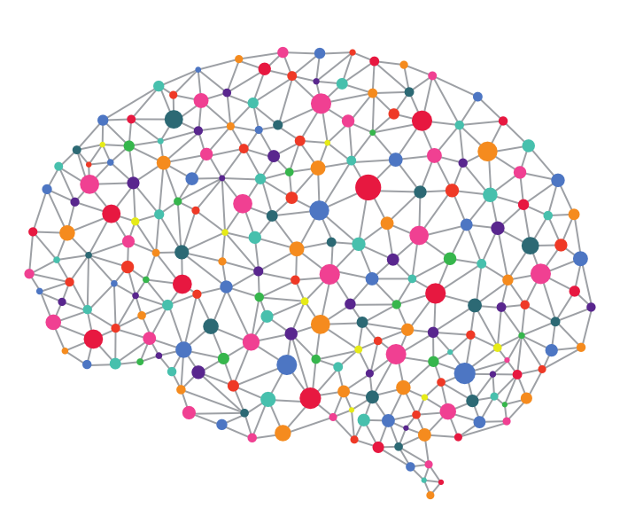

# **Python Application Development Using TensorFlow** #
 <!--images-->


**TensorFlow** is an open source software library for numerical computation using data flow graphs. The graph nodes represent mathematical operations, while the graph edges represent the multidimensional data arrays (tensors) that flow between them. This flexible architecture enables you to deploy computation to one or more CPUs or GPUs in a desktop, server, or mobile device without rewriting code. TensorFlow also includes TensorBoard, a data visualization toolkit.

TensorFlow was originally developed by researchers and engineers working on the Google Brain team within Google's Machine Intelligence Research organization for the purposes of conducting machine learning and deep neural networks research. The system is general enough to be applicable in a wide variety of other domains, as well. Unlike other numerical libraries intended for use in Deep Learning like Theano, TensorFlow was designed for use both in research and development and in production systems. It can run on single CPU systems, GPUs as well as mobile devices and large scale distributed systems of hundreds of machines.

### Computation in TensorFlow ###
Computation is described in terms of data flow and operations in the structure of a directed graph.
- Nodes: Nodes perform computation and have zero or more inputs and outputs. Data that moves between nodes are known as tensors, which are multi-dimensional arrays of real values.
- Edges: The graph defines the flow of data, branching, looping and updates to state. Special edges can be used to synchronize behavior within the graph, for example waiting for computation on a number of inputs to complete.
- Operation: An operation is a named abstract computation which can take input attributes and produce output attributes. For example, you could define and add or multiply operation.

Libraries like TensorFlow and Theano are not simply deep learning libraries, they are libraries for deep learning. They are actually just number-crunching libraries, much like Numpy is. The difference is, however, a package like TensorFlow allows us to perform specific machine learning number-crunching operations like derivatives on huge matricies with large efficiency. We can also easily distribute this processing across our CPU cores, GPU cores, or even multiple devices like multiple GPUs. But that's not all! We can even distribute computations across a distributed network of computers with TensorFlow. So, while TensorFlow is mainly being used with machine learning right now, it actually stands to have uses in other fields, since really it is just a massive array manipulation library.

**What is a tensor?** Most simply, a tensor is an array-like object, and an array can hold your matrix, your vector, and really even a scalar.

At this point, we just simply need to translate our machine learning problems into functions on tensors, which is possible with just about every single ML algorithm. Consider the neural network. 

**What does a neural network break down into?**
We have data $(X)$, weights $(w)$, and thresholds $(t)$. Are all of these tensors? X will be the dataset (an array), so that's a tensor. The weights are also an array of weight values, so they're tensors too. Thresholds? Same as weights. Thus, our neural network is indeed a function of $X,w,$ and $t$, or $f(X,w,t). $

### Computation with TensorFlow ###
The example below shows how you can create a session, define constants and perform computation with those constants using the session.
```python
import tensorflow as tf
sess = tf.Session()
a = tf.constant(10)
b = tf.constant(32)
print(sess.run(a+b))
```
Running this example displays:
	42