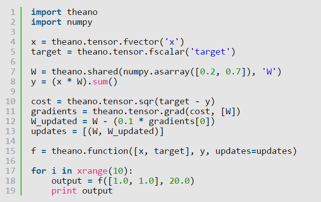

# **Python Application Development Using Theano** #
 <!--images-->

**Theano** is a Python library that lets you to define, optimize, and evaluate mathematical expressions, especially ones with multi-dimensional arrays (numpy.ndarray). Using Theano it is possible to attain speeds rivaling hand-crafted C implementations for problems involving large amounts of data. It can also surpass C on a CPU by many orders of magnitude by taking advantage of recent GPUs.

Theano combines aspects of a computer algebra system (CAS) with aspects of an optimizing compiler. It can also generate customized C code for many mathematical operations. This combination of CAS with optimizing compilation is particularly useful for tasks in which complicated mathematical expressions are evaluated repeatedly and evaluation speed is critical. For situations where many different expressions are each evaluated once Theano can minimize the amount of compilation/analysis overhead, but still provide symbolic features such as automatic differentiation.

Theano’s compiler applies many optimizations of varying complexity to these symbolic expressions. These optimizations include, but are not limited to:
- use of GPU for computations
- constant folding
- merging of similar subgraphs, to avoid redundant calculation
- arithmetic simplification (e.g. x*y/x -> y, --x -> x)
- inserting efficient BLAS operations (e.g. GEMM) in a variety of contexts
- using memory aliasing to avoid calculation
- using inplace operations wherever it does not interfere with aliasing
- loop fusion for elementwise sub-expressions
- improvements to numerical stability 

### What does it do that they don’t? ###
Theano is an optimizing compiler for manipulating and evaluating expressions, especially matrix-valued ones. Manipulation of matrices is typically done using the numpy package, so what does Theano do that Python and numpy do not?
-	execution speed optimizations: Theano can use g++ or nvcc to compile parts your expression graph into CPU or GPU instructions, which run much faster than pure Python.
-	symbolic differentiation: Theano can automatically build symbolic graphs for computing gradients.
-	stability optimizations: Theano can recognize [some] numerically unstable expressions and compute them with more stable algorithms.

### Installation ###
To use Theano, you have to install it.
```{r, engine='shell', count_lines}
pip install theano
```
**Minimal Working Example**
Here is the smallest example I could come up with, which uses Theano and actually does something:
```python
import theano
import numpy
x = theano.tensor.fvector('x')
W = theano.shared(numpy.asarray([0.2, 0.7]), 'W')
y = (x * W).sum()
f = theano.function([x], y)
output = f([1.0, 1.0])
print output
```
**So what’s happening here?**
We first define a Theano variable x to be a vector of 32-bit floats, and give it name ‘x’:
```python
x = theano.tensor.fvector('x')
```
Next, we create a Theano variable W, assign its value to be vector [0.2, 0.7], and name it ‘W’:
```python
W = theano.shared(numpy.asarray([0.2, 0.7]), 'W')
```
We define y to be the sum of all elements in the element-wise multiplication of x and W:
```python
y = (x * W).sum()
```
We define a Theano function f, which takes as input x and outputs y:
```python
f = theano.function([x], y)
```
Then call this function, giving as the argument vector [1.0, 1.0], essentially setting the value of variable x:
```python
output = f([1.0, 1.0])
```
The script prints out the summed product of [0.2, 0.7] and [1.0, 1.0], which is:
0.2*1.0 + 0.7*1.0 = 0.9

**Try this:**
  <!--images-->


